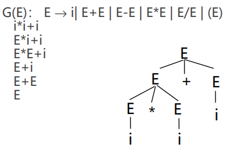
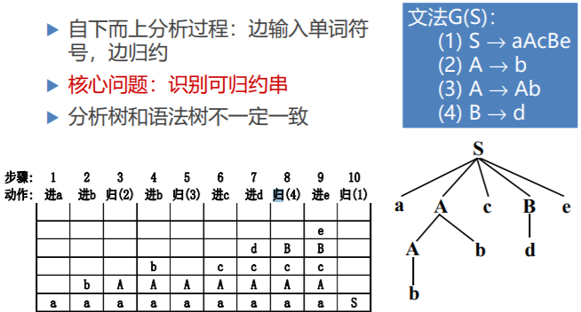
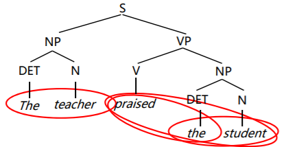

# 语法分析-自下而上分析1

## 自下而上分析

定义：

- 从输入串开始，逐步进行归约，直到文法的开始符号
- 归约：根据文法的产生式规则，把串中出现的产生式的右部替换成左部符号
- **从树叶节点开始，构造语法树**
- 算符优先分析法、LR分析法

#### 移进－归约思想

- 用一个寄存符号的先进后出栈，把输入符号一个一个地移进到栈里，当栈顶形成某个产生式的候选式时，即把栈顶的这一部分替换成(归约为)该产生式的左部符号

图中的树称为分析树（区别于语法树）（对于某些分析方法，分析树与语法树不一定完全一样）

第4步对于b来说，它是一个可归约串，但是对于整个句子来说，它不是一个可归约串

## 短语与直接短语

#### 短语

令G是一个文法，S是文法的开始符号， 假定αβδ是文法G的一个句型，如果有
$$
S \Rightarrow \alpha A \delta \space 且 \space A \Rightarrow \beta
$$
则β称是句型αβδ相对于非终结符A的短语

#### 直接短语

**如果有A => β,则称β是句型αβδ相对于规则A→ β的直接短语**

直接短语代表了**可立即归约**的串（不需要与其他串组合）

#### 短语和直接短语

在一个句型对应的语法树中:

- 以某非终结符为根的**两代以上的子树的所有末端结点从左到右排列**就是相对于该非终结符的一个**短语**
- 如果子树只有两代，则该短语就是**直接短语**

短语： i~1~ ，i~2~，i~3~， i~1~*i~2~ ，i~1~*i~2~+i~3~

直接短语：i~1~ ，i~2~，i~3~

## 分析过程描述

## 算符优先文法

如果规定算符的优先次序，并按 这种规定进行归约，则归约过程是唯一的

#### 优先关系

任何两个可能相继出现的终结符a与b可能三种优先关系：

- a < b，a的优先级低于b
- a = b，a的优先级等于b
- a > b，a的优先级高于b

算符优先关系与数学上的<>=不同

- \+ < + 右边的+号优先级高于左边的+号
- a < b并不意味着b > a，如 `( < +` 和 `+ < (` (两个符号谁在左边谁的优先级低)

#### 算符文法

一个文法，如果它的任一产生式的右部都**不含两个相继(并列)的==非终结符==**，即不含…QR…形式的产生式右部，则我们称该文法为**算符文法**

#### 算符优先文法

假定G是一个不含 ε-产生式的算符文法。对于任何一对终结符a、b，我们说：

- a = b，当且仅当文法G中含有形如P→…ab… 或 P→…aQb…的产生式；
- a < b，当且仅当G中含有形如P→…aR…的产生式， 而 R⇒b… 或 R⇒Qb…
- a > b，当且仅当G中含有形如P→…Rb…的产生式， 而 R⇒…a 或 R⇒…aQ

示例：

##### 优先关系表

第一列表示处于左边的符号，第一行表示处于右边的符号

## 构造优先关系表

#### FIRSTVT和LASTVT集合

$$
FIRSVT(P) = \{a | P \Rightarrow a ... 或 P \Rightarrow Qa ..., a \in V_T且Q \in V_N \}
$$

P 推出的串里，从左至右第一个终结符
$$
LASTVT(P) = \{a | P \Rightarrow ... a 或 P \Rightarrow ... aQ, a \in V_T且Q \in V_N \}
$$
P 推出的串里，最后出现的终结符

##### 构造优先关系表的算法

根据FIRSTVT和LASTVT集合，检查每个产生式的候选式，确定满足关系 < 和 > 的所有终结符对

- 假定有个产生式的一个候选形为 … aP…， 那么，对任何 $$b \in FIRSTVT( P )$$，有 a < b
- 假定有个产生式的一个候选形为… Pb…， 那么，对任何 $$a \in LASTVT(P)$$，有 a > b

##### 构造集合FIRSTVT(P)的算法

反复使用下面两条规则构造集合FIRSTVT(P)：

- 若有产生式P→a … 或P→Qa…，则 $$a \in FIRSTVT(P)$$
-  若$$a \in FIRSTVT(Q)$$，且有产生式P→Q…，则$$a \in FIRSTVT(P)$$

算法的一种实现

- **布尔数组F[P，a]**，使得F[P，a]为真的条件是，当且仅当$$a \in FIRSTVT(P)$$。开始时，按上述的规则1对每个数组元素F[P，a]赋初值
- **栈STACK**，把所有初值为真的数组元素F[P，a]的符号对(P，a)全都放在STACK之中
    - 若栈STACK不空，就将栈顶项弹出，记此项为 (Q，a )。对于每个形如 P → Q…的产生式，若F[ P，a]为假，则变其值为真且将( P，a)推进STACK栈
    - 上述过程一直重复，直至栈STACK为空为止

主程序中黑色代码为初始化，蓝色为使用规则1，红色使用规则2

直至栈为空，构造集合完毕

##### 构造集合LASTVT(P)的算法

反复使用下面两条规则构造集合LASTVT(P)：

- 若有产生式P→... a 或P→...aQ，则 $$a \in LASTVT(P)$$
-  若$$a \in LASTVT(Q)$$，且有产生式P→...Q，则$$a \in LASTVT(P)$$

#### FIRSTVT和LASTVT集合计算示例

反复扫描，直到矩阵不再变化

#### 构造优先关系表的算法

- 通过检查G的每个产生式的每个候选式，可找出所有满足a = b的终结符对
- 根据FIRSTVT和LASTVT集合，检查每个产生式的候选式，确定满足关系 < 和 > 的所有终结符对
    - 假定有个产生式的一个候选形为 … aP…， 那么，对任何 $$b \in FIRSTVT( P )$$，有 a < b
    - 假定有个产生式的一个候选形为… Pb…， 那么，对任何 $$a \in LASTVT(P)$$，有 a > b

#### 构造优先关系表示例

考虑**#E#**可以完成最后一列的判断

## 算符优先分析算法

#### 最左素短语

一个文法G的句型的素短语是指这样一个短语， 它至少含有**一个终结符**，并且，除它自身之外不再含任何更小的素短语

**终结符或是算符的优先关系是基于终结符进行比较的，因此，定义至少含有一个终结符的短语以便进行算符的比较**

**最左素短语**是指处于句型最左边的那个素短语

#### 最左素短语定理

算符优先文法句型(括在两个＃之间)的一般形式：
$$
\#N_1a_1N_2a_2…N_na_nN_{n+1}) \#
$$
其中，a~i~都是终结符，N~i~是可有可无的非终结符(**算符文法不能连续出现两个非终结符，但是可以连续出现多个终结符**)

**定理：一个算符优先文法G的任何句型的最左素短语是满足如下条件的最左子串 N~j~a~j~…N~i~ a~i~N~i+1~**

**内部终结符的优先级相等，都大于外部的终结符**

#### 算符优先分析算法描述

- 使用一个符号栈S，用它寄存终结符和非终结符，k代表符号栈S的使用深度
- 在正确的情况下，算法工作完毕时，符号栈S应呈现：# N #

黑色部分代码将j指向栈中**最上面的终结符**

蓝色部分判断S[j]与输入的终结符符a的优先级，若a的优先级大于或等于S[j]，则a入栈，优先进行归约，若连续输入a的优先级一直大于等于S[j]，则一直读入终结符，**直到a的优先级小于S[j]**（此时栈顶即最左素短语的尾部）

执行红色部分代码，紫色部分是扫描寻找最左素短语的头部（栈上面的终结符优先级比下面的终结符高）

找到一个最左素短语后，进行归约，归约规则如下：

从左至右，**终结符与终结符要对应相等**，非终结符可以不完全对应（只要是非终结符就行，可忽略）

按照以上方法分析出来的分析树与语法树不同，分析树可能会简单一些，但是二者都表达了文法的结构

