# 语法分析-自下而上分析2

## 句柄和规范归约

#### LR分析法

- L：从左到右扫描输入串
- R：自下而上进行归约

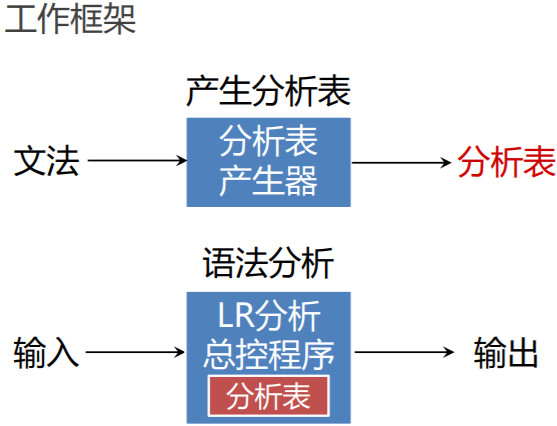

#### 句柄和规范归约

##### 短语、直接短语和句柄

- 短语：以某非终结符为根的**两代以上的子树的所有末端结点从左到右排列**就是相对于该非终结符的一个短语
- 直接短语：如果子树只有两代，则该短语就是直接短语
- 句柄：最左两代子树末端就是**句柄**

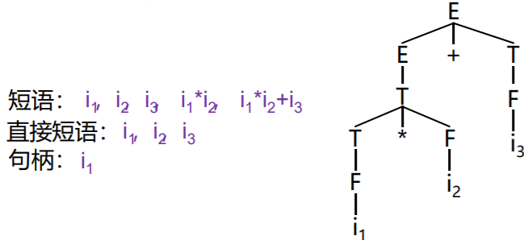

##### 用句柄归约

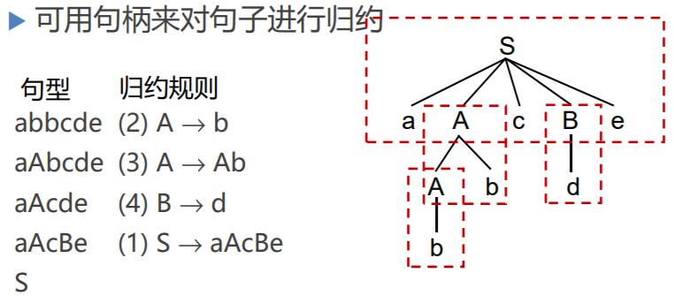

总是找最左两代子树进行归约。

##### 规范归约

定义：假定α是文法G的一个句子，我们称序列 αn， αn-1，… ，α0 是α的一个**规范归约**，如果此序列满足：

1. α~n~ = α
2. α~0~为文法的开始符号，即α~0~ = S
3. 对任何i，0 ≤ i ≤ n， α~i-1~是从α~i~经把句柄替换成为相应产生式左部符号而得到的

##### 规范句型

- 规范归约是**最左归约**
- 规范归约的逆过程就是最右推导（S => aAcBe => aAcde => aAbcde => abbcde）
- 最右推导也称为**规范推导**
- 由规范推导推出的句型称为**规范句型**

## LR分析法

规范归约的关键问题是寻找句柄。

- 历史：已移入符号栈的内容
- 展望：根据产生式推测未来可能遇到的输入符号
- 现实：当前的输入符号

#### LR分析器的结构

把"历史"及"展望"综合抽象成 状态；由**栈顶的状态**和现行的**输入符号**唯一**确定**每一步工作。

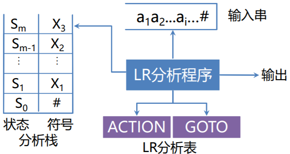

#### LR分析表

- **ACTION[s，a]**：当状态s面临输入符号a时，应采取什么动作
- **GOTO[s，X]**：状态s面对文法符号X时，下一状态是什么

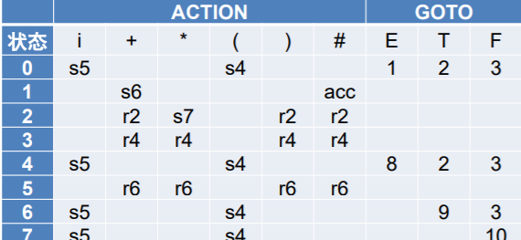

- **移进(shift)**：把(s，a)的下一状态s’和输入符号a推进栈，下一输入符号变成现行输入符号
- **归约(reduce)**：用某产生式A→β进行归约。 假若β的长度为r， 去除栈顶r个项，使状态s~m-r~变成栈顶状态，然后把下一状态s’=GOTO[s~m-r~, A]和文法符号A推进栈
- **接受(acc)**：宣布分析成功，停止分析器工作
- 空着的即error

#### LR分析过程

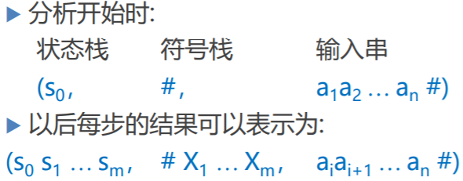

用上述三元组即可对分析的每一步进行描述。

$$
(s_0 s_1 ... s_m , \space \# X_1 ... X_m, \space a_{i+1} ... a_n \#
$$
分析器根据ACTION(s~m~ , a~i~)确定下一步动作：

- ACTION(s~m~ , a~i~)为移进，且*s*为下一状态，则格局变为:
$$
(s_0 s_1 ...s_m \textcolor{red}{s} , \space \# X_1 ... X_ma_i, \space \textcolor{red}{a_{i+1}} ... a_n \#
$$

- 若ACTION(s~m~ , a~i~)为按$A \to \beta$归约，格局变为:

    - **此处, s=GOTO(s~m-r~, A), r为β的长度, β= X~m-r+1~… Xm**
$$
(s_0 s_1 ...s_{m-r} \textcolor{red}{s} , \space \# X_1 ... X_{m-r} \textcolor{red}{A}, \space ai a_{i+1} ... a_n \#
$$

- 若ACTION(s~m~ , a~i~)为“接受”，则格局变化过程终止，宣布分析成功
- 若ACTION(s~m~ , a~i~)为“报错”，则格局变化过程终止，报告错误

##### 归约过程

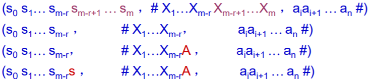

1. 弹出被归约符号（句柄）及对应的状态
2. 将归约后的A压到符号栈的栈顶
3. 根据**状态s~m-r~**与**A**查GOTO表，将下一个状态压入符号栈

## LR分析示例

LR分析性质：

- 在任何时候，分析栈中的内容和扫描串剩下的内容拼接起来总是一个规范句型
- 一旦栈顶出现了当时栈内内容，和栈外输入串拼接出来的句型的句柄，立刻归约

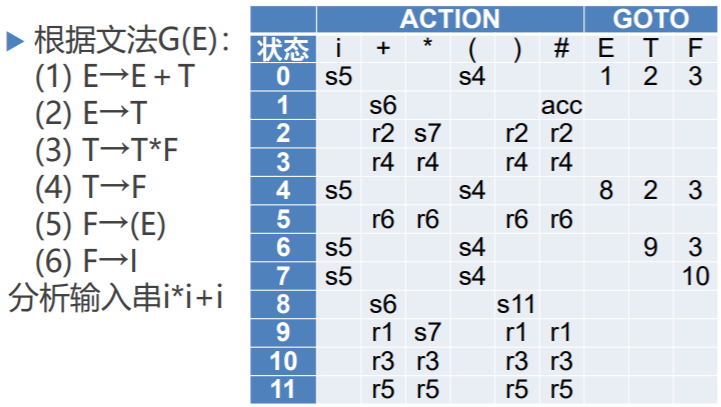

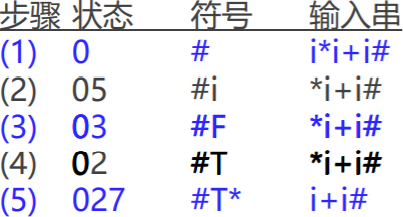

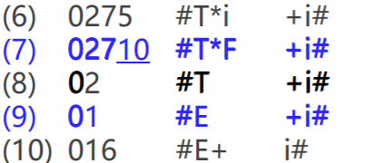

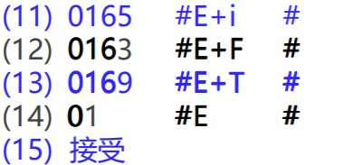

## LR文法

- 对于一个文法，如果能够构造一张分析表，使得它的每个入口均是唯一确定的，则这个文法就称为**LR文法**
- 一个文法，如果能用一个每步顶多向前检查k个输入符号的LR分析器进行分析，则这个文法就称为**LR(k)文法**

#### LR文法与二义文法

- LR文法不是二义的，二义文法肯定不会是LR的
- LR文法 ⊂ 无二义文法（有一些无二义的文法构造出的LR分析表有冲突，但仍是无二义的）
- 非LR结构
    - S → iCtS | iCtSeS

**可以手动消除LR分析表中的冲突项**