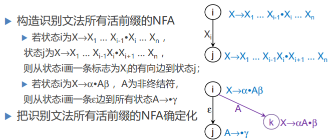
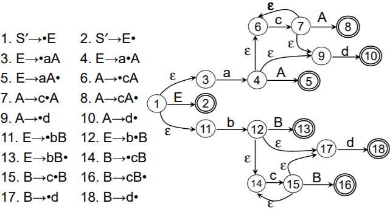
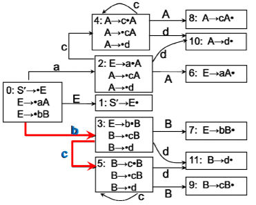
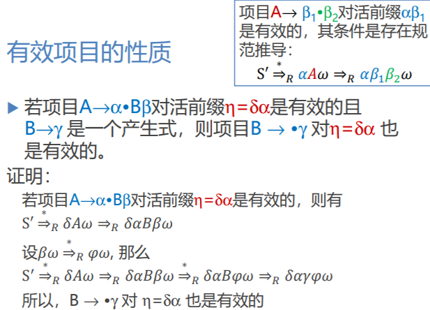
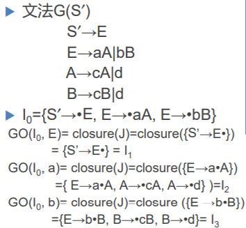
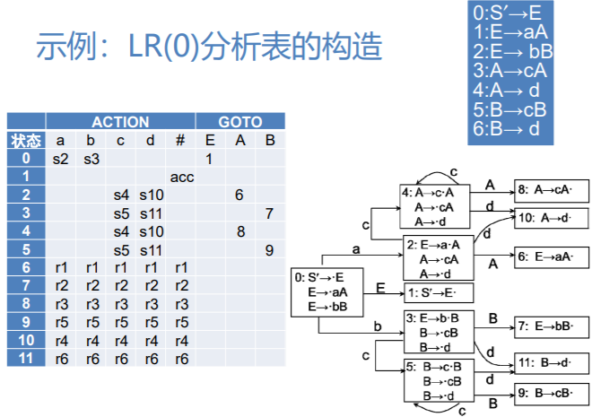

# 语法分析-自下而上分析3

## 活前缀

- 字的前缀：是指字的任意首部，如字abc的前缀有 ε，a，ab，abc

- 活前缀：是指**规范句型**的一个前缀，这种前缀不含句柄之后的任何符号

    - 对于规范句型 αβδ，β为句柄，如果 **αβ = u~1~ u~2~…u~r~**，则符号串 u~1~u~2~…u~i~(1 ≤i≤r)是αβδ 的活前缀。( δ必为终结符串)

**句柄只能在分析栈的顶部，不能在栈内部。**

**规范归约过程中，保证分析栈中总是活前缀，就说明分析采取的移进/归约动作是正确的。**

## 构造识别活前缀的DFA

#### 文法的拓广

- 将文法G(S)拓广为G′(S′)
    - 构造文法G′，它包含了整个G，并引进不出现在G中的非终结符S′、以及产生式S′→S，S′是G′的开始符号
    - 称G′是G的拓广文法

#### LR(0)项目

- 在每个产生式的右部添加一个圆点，表示我们在分析过程中看到了产生式多大部分
- `A→XYZ`有四个项目
    - A→ •XYZ
    -  A→X•YZ
    - A→XY•Z
    - A→XYZ•
- A→α• 称为"归约项目"
- 归约项目 S′→α• 称为"**接受项目**"（整个句子都识别完毕）
- A→α•aβ (a∈V~T~) 称为"**移进项目**"（下一个读入字符a）
- A→α•Bβ (B∈V~N~) 称为"**待约项目**"（等待B归约完毕）

#### 构造识别文法所有活前缀的DFA

- 对于上面的NFA，j相比于i多识别了一个X~i~，因此从状态i画一条标志为X~i~的有向边到状态j
- 对于下面的NFA，如果状态i对应一个**待约项目**，画一个ε边到所有状态A → • γ，当A归约完后，从i射出A弧至状态k

#### 识别活前缀的NFA

## 通过计算项目集规范族构造识别活 前缀的DFA

构成识别一个文法活前缀的DFA的项目集(状态)的全体称为文法的**LR(0)项目集规范族**。

#### 有效项目

- 项目 A → β~1~ • β~2~对活前缀αβ~1~是有效的，其条件是存在规范推导
    $$
    S' \Rightarrow _R \alpha A \omega \Rightarrow _R \alpha \beta_1 \beta_2 \omega
    $$

-  在任何时候，分析栈中的活前缀 X~1~X~2~ … X~m~ 的有效项目集正是从识别活前缀的DFA的初态出发，读出 X~1~X~2~ … X~m~ 后到达的那个项目集(状态)

**状态5中的产生式对于活前缀bc是有效的（从初态读入bc到达状态5）**

#### 有效项目的性质

## LR(0)项目集规范族的构造

- 将文法G(S)拓广为G ′(S ′ )
    - 构造文法G ′，它包含了整个G，并引进不出现在G中的非终结符S ′、以及产生式S ′→S，S ′是G ′的开始符号
    - G ′唯一的“接受”态：仅含项目S ′ → S•的状态

#### 项目集的闭包CLOSURE

假定I是文法G'的任一项目集，定义和构造I的包CLOSURE(I)如下： 

1. I的任何项目都属于CLOSURE(I)； 
2. 若A → α•Bβ属于CLOSURE(I)，那么，对任 何关于A的产生式B → γ，项目B → •γ也属于 CLOSURE(I)；
3. 重复执行上述两步骤直至CLOSURE(I) 不再增大为止

- **简单来说第2步就是找等价的产生式，如A → α•Bβ，未读入B，此时可以查找B的产生式右部最左端为•的项目(B → •任意符号)**

- **项目的•之后若为终结符或•处于末尾则不用找等价项目**

#### 状态转换函数

为了识别活前缀，我们定义一个状态转换函数 GO。I是一个项目集，X是一个文法符号。

函数值GO(I，X)定义为： **GO(I，X)＝CLOSURE(J)** 

其中 J＝{任何形如A → αX•β的项目| A → α•Xβ属于I}。

直观上说，若I是对某个活前缀 γ 有效的项目集， 那么，GO(I，X)便是对 γX 有效的项目集。

**直白点，从I到GO（I,X)这个结果的状态集就是相当于识别了一个X，及I识别X后到达的状态集**

## 构造LR(0)分析表

假若一个文法G的拓广文法G ′的活前缀识别自动机中的每个状态(项目集)不存在下述情况：

- 既含移进项目又含归约项目
- 含有多个归约项目

则称G是一个**LR(0)文法**。

