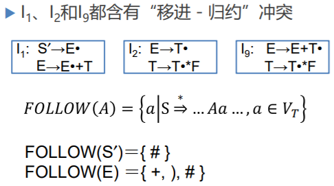
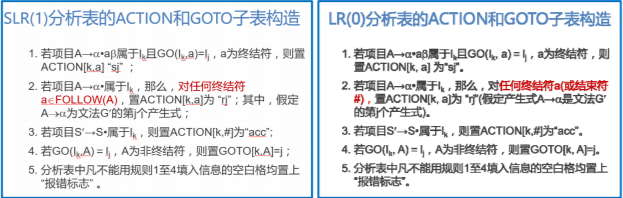
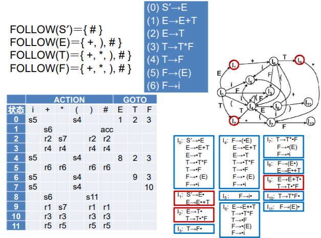
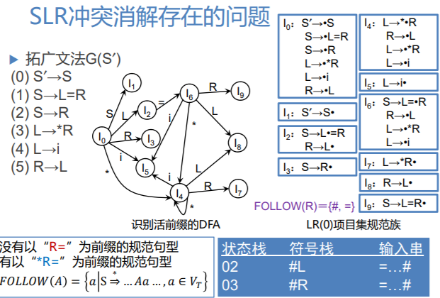
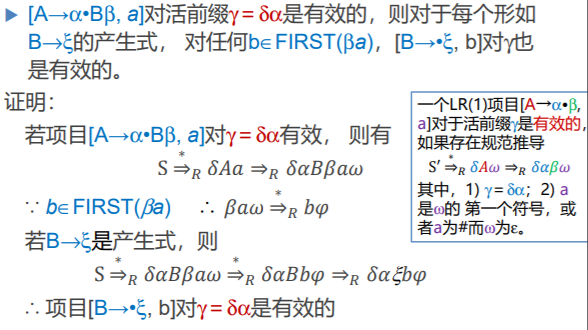
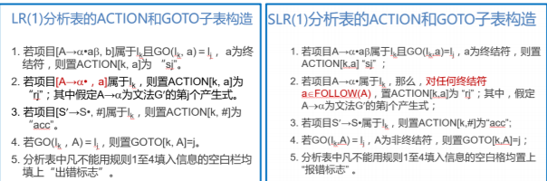
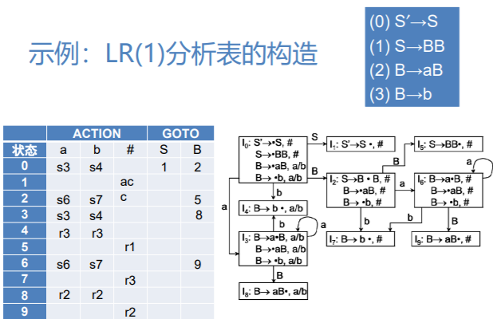

# 语法分析-自下而上分析4

## 更强的LR分析

根据当前符号来判断，若当前符号为#，则按第一个项目进行归约，若当前符号为+，则按照第二个项目移进

## SLR(1)分析

#### SLR(1)冲突解决办法

假定LR(0)规范族的一个项目集
$$
I=\{\textcolor{skyblue}{A_1→ α•a_1β_1, A_2 → α • a_2 β_2, …,A_m → α • a_m β_m}, \textcolor{red}{B_1 → α•, B_2 → α•, …, B_n → α•}\}
$$
如果集合$$\textcolor{skyblue}{\{a_1, …, a_m\}}, \textcolor{red}{FOLLOW(B_1), …, FOLLOW(B_n)}$$两两不相交(包括不得有两个FOLLOW集合有#)，则当状态I面临任何输入符号a 时：

1. 若a是某个a~i~，i=1,2,…,m，则移进；
2. 若a ∈FOLLOW(B~i~)，i=1,2,…,n，则用产生式B~i~ → α 进行归约；
3. 此外，报错。

`SLR(1)解决办法`： **S-Simple， 1-最多向前看一个单词**

#### SLR(1)分析表的构造

#### SLR(1)文法

- 按上述方法构造出的ACTION与GOTO表如果不含多重入口，则称该文法为**SLR(1)文法**
- 使用SLR表的分析器叫做一个**SLR分析器**
- 每个SLR(1)文法都是无二义的。但也存在许多无二义文法不是SLR(1)的
- **LR(0) ⊂ SLR(1) ⊂ 无二义文法**

#### SLR(1)分析表构造示例

## LR(1)分析法

#### 一个非SLR(1)文法

对于状态2识别 `=` ，由于FOLLOW(R)含有 `=` ，所以不能判断移进归约，但是对文法进行分析，可知文法中没有以 `R=` 为前缀的规范句型，只有以 `*R=*` 为前缀的规范句型，所以状态2中的归约项是无效的。

**需要根据当前栈内的活前缀或其它更具体的信息来判断选择下一个能接受的符号。**

#### LR(1)分析表的构造

- 把G拓广为G′
- 对G′构造LR(1)项目集规范族C和活前缀识别自动机的状态转换函数GO
- 使用C和GO，构造LR(1)分析表

##### LR(k)项目

- **LR(k)项目**：扩展LR(0)项目，附带有k个终结符$$[A → α•β, a_1a_2…a_k]$$， a~1~a~2~…a~k~ 称为**向前搜索符串**(或展望串)。
- 归约项目$$[A → α•β, a_1a_2…a_k]$$的意义：当它所属的状态呈现在栈顶且后续的k个输入符号为 a~1~a~2~…a~k~ 时，**才可以把栈顶上的α归约为A**。
- 对于任何移进或待约项目$$[A → α•β, a_1a_2…a_k]$$，β ≠ ε，搜索符串 a~1~a~2~…a~k~ 没有直接作用

##### 有效项目

形式上我们说一个LR(1)项目[A → α•β, a]对于**活前缀γ**是有效的，如果存在规范推导
$$
S' \Rightarrow \delta A \omega \Rightarrow \delta \alpha \beta \omega
$$

- `γ ＝ δα`
-  a是ω的第一个符号，或者a为#而ω为ε

**当A归约的瞬间，当时面临的单词应当是a。**

##### 有效项目的性质

#### LR(1)分析表构造算法

##### 项目集的闭包CLOSURE

假定I是文法G ′的任一项目集，定义和构造I的闭包CLOSURE(I)如下：

1. I的任何项目都属于CLOSURE(I)
2. 若项目[A → α•Bβ, a]属于CLOSURE(I)，B → ξ 是一个产生式，那么，对于FIRST(βa) 中的每个 终结符b，如果[B → •ξ, b]原来不在CLOSURE(I) 中，则把它加进去
3. 重复执行步骤2，直至CLOSURE(I)不再增大为止

##### 项目集的转换函数GO

令I是一个项目集，X是一个文法符号，函数 GO(I，X)定义为：
$$
GO(I，X)＝CLOSURE(J)\\
J ＝ \{ 任何形如[ A→ αX• β, a ]的项目 \space | \space [ A→ α•X β, a ] ∈I \}
$$
**J为I读入一个字符X后的项目。**

##### LR(1)分析表的ACTION和GOTO子表构造

#### LR(1)分析表和LR(1)文法

- 按上述算法构造的分析表，若不存在多重定义的入口(即，动作冲突)的情形，则称它是文法G的一张规范的**LR(1)分析表**
- 具有规范的LR(1)分析表的文法称为一个**LR(1)文法**
- 使用LR(1)分析表的分析器叫做一个**规范的LR分析器**
- LR(1)状态比SLR(1)多
- **LR(0) ⊂ SLR(1) ⊂ LR(1) ⊂ 无二义文法**

#### LR(1)分析表构造示例

## 分析器产生工具

#### YACC

**Yet Another Compiler Compiler**

- GNU Bison：基本兼容Yacc，与flex一起使用
- Berkeley Yacc

[The Lex & Yacc Page](http://dinosaur.compilertools.net/)