# 属性文法和语法制导翻译1

## 属性文法

#### 属性文法概念

- 属性文法,也称属性翻译文法
- 以上下文无关文法为基础
    - 为每个文法符号（终结符或非终结符）配备若干相关的“值”（称为**属性**），代表与文法符号相关信息，如类型、值、代码序列、符号表内容等
    - 对于文法的每个产生式都配备了一组属性的**语义规则**，对属性进行计算和传递
    - 语义规则除了数值的计算规则之外，还可以用来描述更为广泛的属性处理功能，如进行类型信息的传递，代码的拼接，符号表的访问和修改，**凡是能够用程序实现的信息处理都可以成为语义规则**

##### 综合属性

- 自下而上传递信息
- 语法规则：根据右部候选式中的符号的属性计算左部被定义符号的**综合属性**
- 语法树：根据子结点的属性和父结点自身的属性计算父节点的**综合属性**

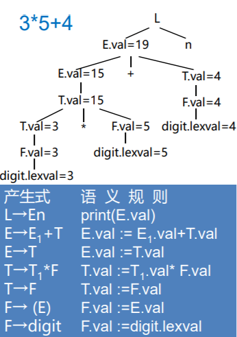

##### 继承属性

- 自上而下传递信息
- 语法规则：根据右部候选式中的符号的属性和左部被定义符号的属性计算右部候选式中的符号的**继承属性**
- 语法树：根据父结点和兄弟节点的属性计算子结点的**继承属性**

**用于变量名的定义：**

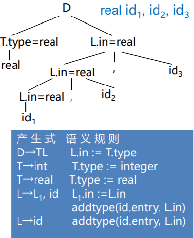

#### 属性依赖

- 对应于每个产生式A → α都有一套与之相关联的语义规则，每条规则的形式为(f是一个函数)：$$b := f(c_1, c_2, …, c_k)$$
- 属性b依赖于属性c~1~, c~2~, …, c~k~
    - b是A的一个**综合属性**并且c~1~, c~2~, …,c~k~是产生式右边文法符号的属性
    - b是产生式右边某个文法符号的一个**继承属性**并且c~1~, c~2~, …, c~k~是A或产生式右边任何文法符号的属性

- **终结符只有综合属性**，由词法分析器提供
    - F → digit
    - digit.lexval
- **非终结符既可有综合属性也可有继承属性**，文法开始符号的所有继承属性作为属性计算前的初始值

#### 语义规则

- 对出现在**产生式右边的继承属性**和出现在**产生式左边的综合属性**都必须提供一个计算规则。属性计算规则中只能使用相应产生式中的文法符号的属性
- 出现在**产生式左边的继承属性**和出现在**产生式右边的综合属性**不由所给的产生式的属性计算规则进行计算，由**其它产生式的属性规则计**算或者由属性计算器的参数提供

语义规则所描述的工作可以包括**属性计算**、**静态语义检查**、**符号表操作**、**代码生成**等。

#### 带注释的语法树

##### 综合属性

- 在语法树中，一个结点的**综合属性**的值由其**子结点**和**它本身**的属性值确定
- 使用自底向上的方法在每一个结点处使用语义规则计算综合属性的值
- 仅使用综合属性的属性文法称**S-属性文法**

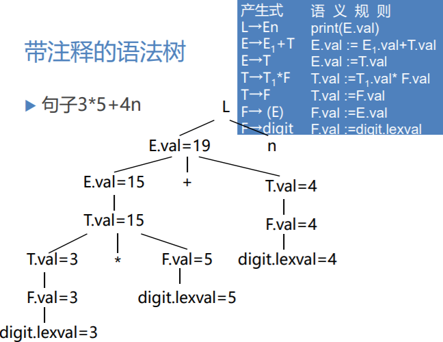

##### 继承属性

- 在语法树中，一个结点的**继承属性**由其**父结点** 、其**兄弟结点**和其**本身**的某些属性确定
- 用继承属性来表示程序设计语言结构中的上下文依赖关系很方便

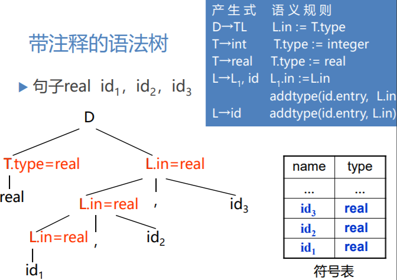

**addtype指的是找到id的入口，拿着父节点的集成属性，去填符号表。**

## 属性计算

#### 基于属性文法的处理方法

- 语义规则的计算
    - 产生代码
    - 在符号表中存放信息
    - 给出错误信息
    - 执行任何其它动作
- 对输入串的翻译就是根据语义规则进行计算

由源程序的语法结构所驱动的处理办法就是**语法制导翻译法**

**输入串 -> 语法树 -> 按照语义规则计算属性**

方法：

- 依赖图
- 树遍历
- 一遍扫描

#### 依赖图

- 在一棵语法树中的结点的继承属性和综合属性之间的相互依赖关系可以由**依赖图(有向图)**来描述

- 为每一个包含过程调用的语义规则引入一个**虚综合属性b**，这样把每一个语义规则都写成
    $$
    b := f(c_1, c_2,…, c_k)
    $$
    

依赖图中为每一个属性设置一个结点，如果属性b依赖于属性c，则从属性c的结点有一条有向边连到属性b的结点

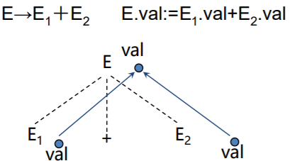

##### 依赖图的构建算法

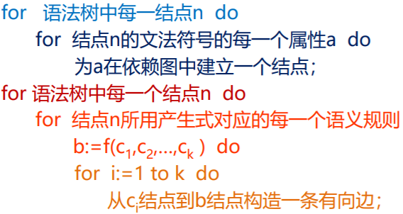

##### 依赖图示例

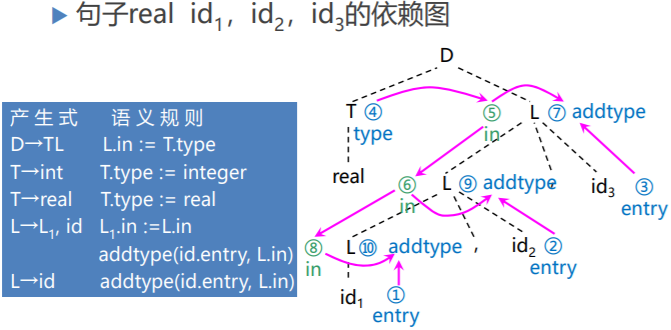

#### 良定义的属性文法

- 如果一属性文法不存在属性之间的循环依赖关系，则称该文法为**良定义的**
- 一个依赖图的任何**拓扑排序**都给出一个语法树中结点的语义规则计算的有效顺序

#### 属性的计算次序

- 基础文法用于建立输入符号串的**语法分析树**
- 根据语义规则建立**依赖图**
- 根据依赖图的拓扑排序，得到计算语义规则的 顺序

**输入串 -> 语法树 -> 依赖图 -> 语义规则计算次序**

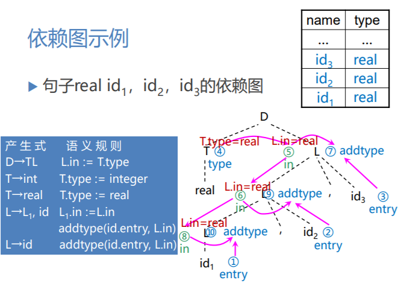

#### 树遍历

- 假设语法树已建立，且树中已带有开始符号的继承属性和终结符的综合属性
- 以某种次序遍历语法树，直至计算出所有属性
- **深度优先，从左到右的遍历**

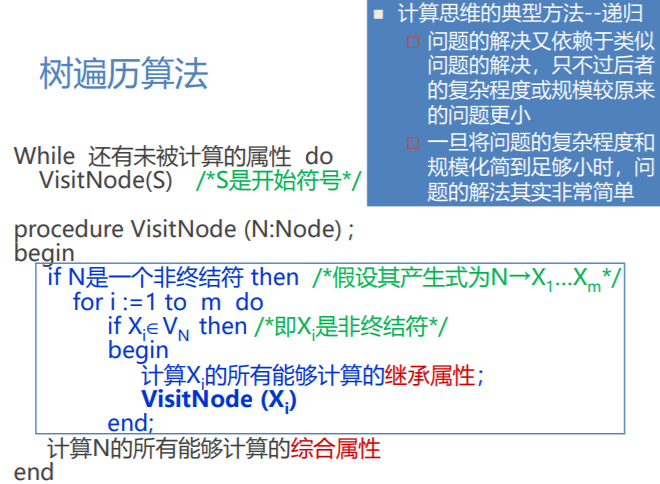

##### 树遍历算法示例

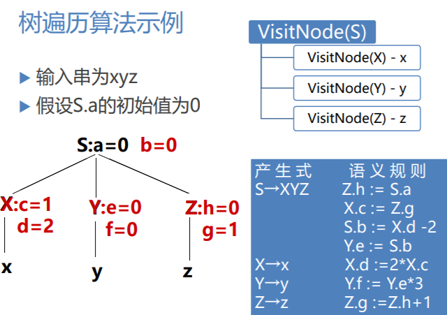

#### 一遍扫描

- 在语法分析的同时计算属性值
    - 所采用的语法分析方法
    - 属性的计算次序
- 所谓**语法制导翻译法**，直观上说就是为文法中每个产生式配上一组语义规则，并且在语法分析的同时执行这些语义规则
- 语义规则被计算的时机
    - 自上而下分析，一个产生式匹配输入串成功时
    - 自下而上分析，一个产生式被用于进行归约时

##### 抽象语法树

**抽象语法树**(Abstract Syntax Tree, AST)，在语法树中去掉那些对翻译不必要的信息，从而获得更有效的源程序中间表示

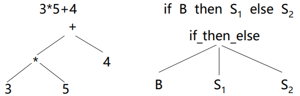

##### 建立表达式的抽象语法树

- **mknode(op, left, right)** 建立一个运算符号结点，标号是op，两个域left和right分别指向左子树和右子树
- **mkleaf(id, entry)** 建立一个标识符结点，标号为id，一个域entry指向标识符在符号表中的入口
- **mkleaf(num, val)** 建立一个数结点，标号为num，一个域val用于存放数的值

##### 建立抽象语法树的语义规则

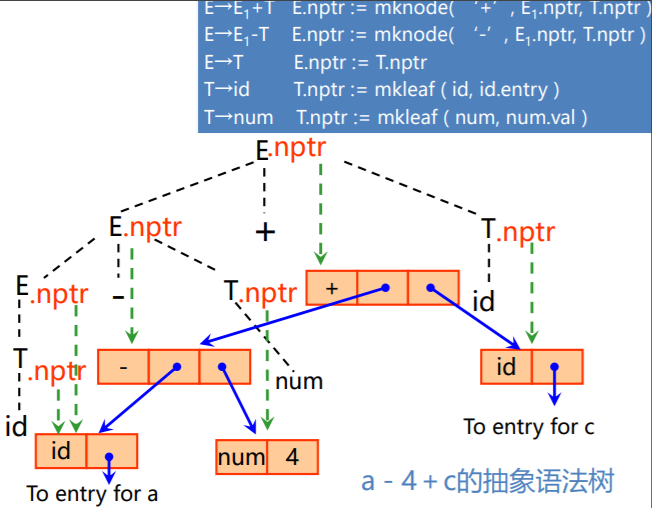