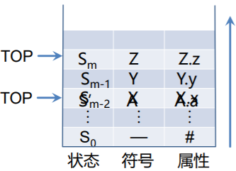
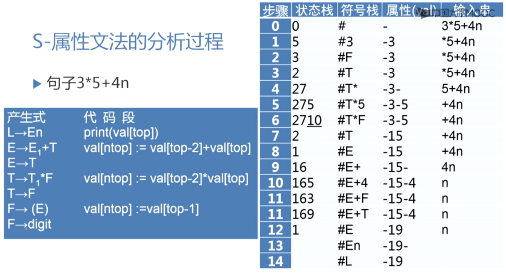
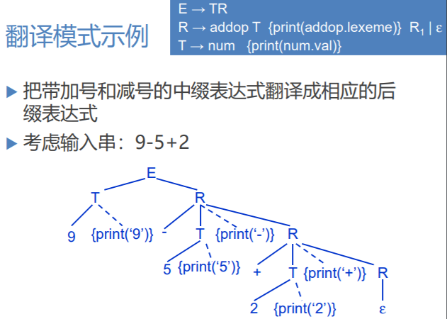
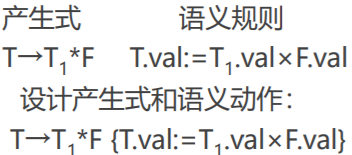
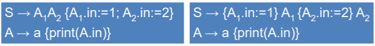
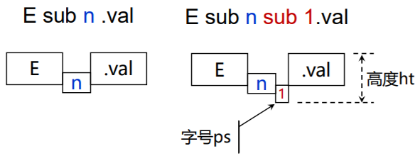
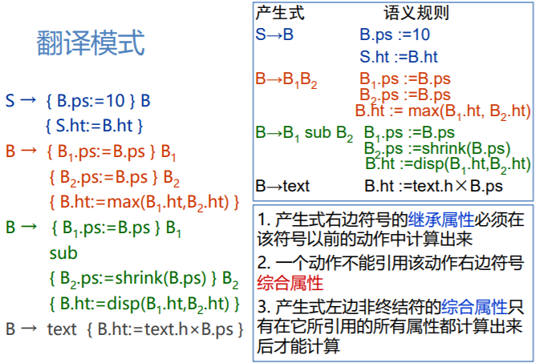
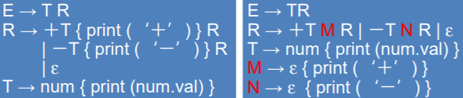
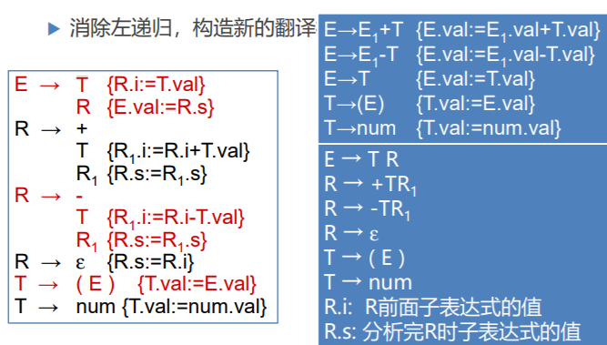
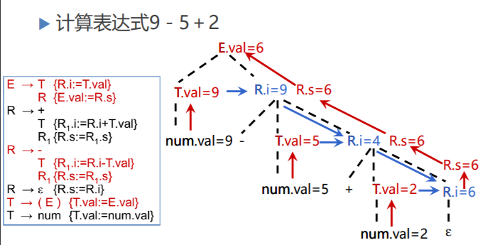

# 属性文法和语法制导翻译2

## S-属性文法

#### S-属性文法的自下而上计算

- S-属性文法：只含有综合属性

- 在自下而上的分析器分析输入符号串的同时计算综合属性

    - 分析栈中保存语法符号和有关的综合属性值

    - 每当进行归约时，新的语法符号的属性值就由栈中正在归约的产生式右边符号的属性值来计算

    - 假设产生式A → XYZ对应的语义规则为 a := f(X.x, Y.y, Z.z)

## L属性文法

#### 一遍扫描的处理方法

- 一遍扫描的处理方法
    - 所采用的语法分析方法
    - 属性的计算次序
- **S-属性文法**适合一遍扫描的自下而上分析
- **L-属性文法**适合一遍扫描的自上而下分析

#### L-属性文法和自顶向下翻译

- 按照深度优先遍历语法树，计算所有属性值
- 与LL(1) 自上而下分析方法结合
    - 深度优先建立语法树
    - 按照语义规则计算属性

#### L-属性文法

一个属性文法称为**L-属性文法**，如果对于每个产生式**A → X~1~X~2~…X~n~**，其每个语义规则中的每个属性或者是综合属性，或者是X~i~(1≤i≤n)的一个继承属性且这个继承属性仅依赖于：

- **产生式中Xi左边符号**X~1~, X~2~, …, X~i-1~的属性
- A的继承属性

**S-属性文法一定是L-属性文法**

## 翻译模式

- **语义规则**：给出了属性计算的定义，没有属性计算的次序等实现细节
- **翻译模式**：给出使用语义规则进行计算的次序，把实现细节表示出来
- 在翻译模式中，和文法符号相关的属性和语义规则（也称**语义动作**），用花括号{}括起来，插入到产生式右部的合适位置上

示例：

#### 设计翻译模式的原则

- 设计翻译模式时，必须保证当某个动作引用一个属性时它必须是有定义的
- **L-属性文法**本身就能确保每个动作不会引用尚未计算出来的属性

#### 建立翻译模式

- 当只需要**综合属性**时：为每一个语义规则建立一个包含赋值的动作，并把这个动作放在相应的**产生式右边的末尾**

- 如果既有综合属性又有继承属性，在建立翻译模式时就必须保证：
    1. 产生式右边的符号的**继承属性**必须在这个符号以前的动作中计算出来

    2. 一个动作不能引用这个动作右边的符号的**综合属性**（**某语义规则所引用到的属性一定不能出现它右边符号的属性，右边符号的属性要等右边符号完全匹配完后才能够得到**）

    3. 产生式左边非终结符的**综合属性**只有在它所引用的所有属性都计算出来以后才能计算。计算这种属性的动作通常可放在产生式右端的**末尾**

左边的产生式违反了第1条，在自伤而下的分析中，A  → a 产生式使用的规则中的属性未定义。

#### 翻译模式示例

##### 数学格式语言EQN

#### 语义动作执行时机统一

- 把所有的语义动作都放在产生式的末尾
    - 语义动作的执行时机统一
- 转换方法
    - 加入新产生式M → ε
    - 把嵌入在产生式中的每个语义动作用不同的非终结符M代替，并把这个动作放在产生式M→ε的末尾

#### 消除翻译模式中的左递归

- 语义动作是在相同位置上的符号被展开（匹配成功）时执行的
- 为了构造不带回溯的自顶向下语法分析，必须消除文法中的左递归
- 当消除一个翻译模式的基本文法的左递归时同时考虑**属性计算**
    - 适合带**综合属性**的翻译模式

#### 消除翻译模式中的左递归的一般方法

